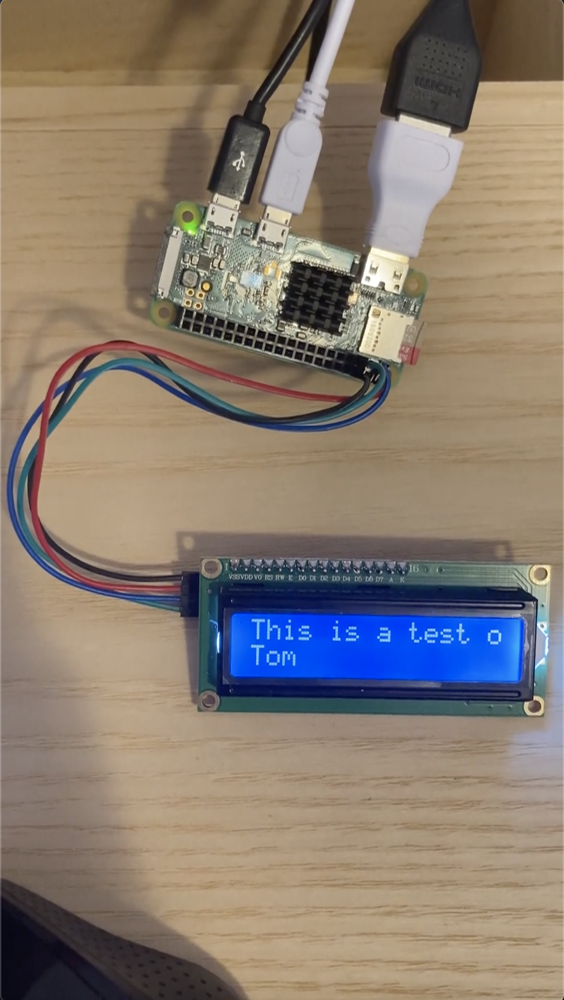

# emailToLCDscreen
A script that will allow anyone to remotely display a message on a 16X2 Raspberry Pi LCD screen via an email

## Hardware
A Raspberry Pi Zero W and a 16x2 display screen is being used for this project. I decided to move from a 16 pin screen to an [i2c screen](https://www.amazon.com/HiLetgo-Display-Backlight-Controller-Character/dp/B00HJ6AFW6/ref=sr_1_6?crid=X9V6EN28119K&dchild=1&keywords=16x2+display+i2c&qid=1594071478&sprefix=16x2+displ%2Caps%2C423&sr=8-6) after realizing that this change allowed me to avoid soldering all together and allowed for a much cleaner final product.

## Libraries
- [imaplib](https://docs.python.org/2/library/imaplib.html) is being used to connnect to a Gmail account to retrieve the email subject and sender. This information is then displayed on line 1 and line 2 of the 16x2 screen respectively.
- [lcddriver.py](https://github.com/the-raspberry-pi-guy/lcd/blob/master/lcddriver.py) is being used to display symbols and scrolling text to the display.

## Final product
The [email_i2c.py](i2c_screen/email_i2c.py) script contains the final version of this project which allows anyone to send an email to a specified Gmail address. The Subject of the email and first name of the sender are then displayed on the screen anywhere in the world as long as the screen is connected to WiFi.

